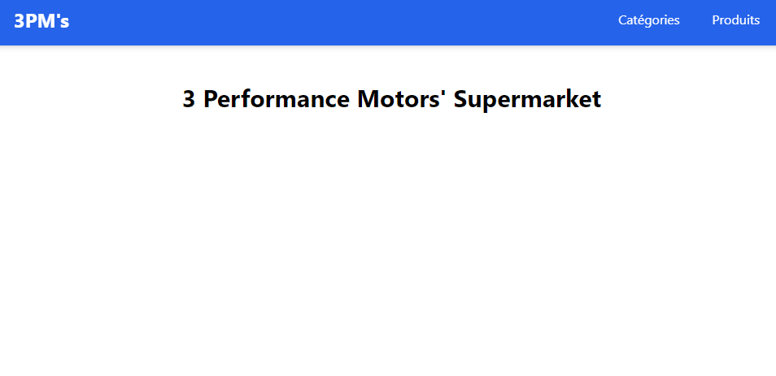
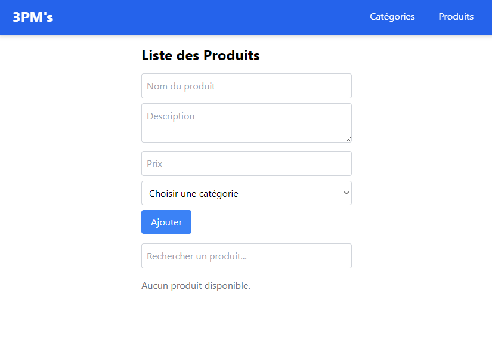
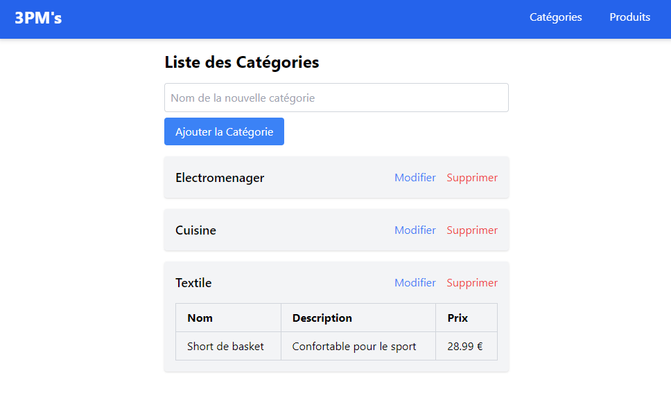

# 3PM'supermarket

Ce projet est une application fullstack conçue pour gérer des produits et leurs catégories. Il inclut le développement d’une API RESTful avec Symfony pour la partie backend, ainsi qu’une interface utilisateur dynamique en React.js pour le frontend.


## Features

- Interface utilisateur réactive et stylisée avec Tailwind CSS.
- Intégration de l'API Symfony pour la gestion des données.
- Architecture modulaire pour un code maintenable.
- Cross platform


## Tech Stack

**Client:**
- React.js : Bibliothèque JavaScript pour créer des interfaces utilisateur.
- Tailwind CSS : Framework CSS utilitaire pour un style rapide et flexible.
- Axios/Fetch : Pour effectuer des appels à l'API.

**Server:**
- Symfony : Framework PHP pour l'API RESTful.
- Doctrine : ORM pour la gestion des bases de données.


## Prérequis

- **PHP 8.2** ou version supérieure
- **Composer**
- **Node.js** avec npm
- **Symfony CLI**
## Installation

**Frontend** :

Installer 3PMsf

1. Clone le repository de 3PMsf

```bash
 git clone https://github.com/TomSawyer1/3PMsf.git  
 cd 3PMsf  
```
2. Installer les dépendences :
```
npm install
```

3. Démarer le serveur :
```
npm start
```
**Backend** :

1. Accèder au dossier backend :

```
cd 3pms
```

2. Installer les dépendences PHP :
```
composer install
```

3. Copiez le fichier `.env` en `.env.local` et ajustez les paramètres, notamment la configuration de la base de données.

4. Crée et migre la base de données :
```
php bin/console doctrine:database:create  
php bin/console make:migration
php bin/console doctrine:migrations:migrate  

```
5. Lancer le serveur Symfony :

```
symfony serve 
```

## Usage

1. Assure-toi que le backend Symfony est en cours d'exécution.

2. Lance l'application React.js.

3. Accède à l'application via http://localhost:3000 .


## Screenshots








## Contributions

Les contributions sont les bienvenues. Ouvre une issue ou soumets une pull request si tu souhaites apporter des améliorations.


## License

Ce projet est sous licence MIT. Consultez le fichier [LICENSE](LICENSE) pour plus d'informations.

